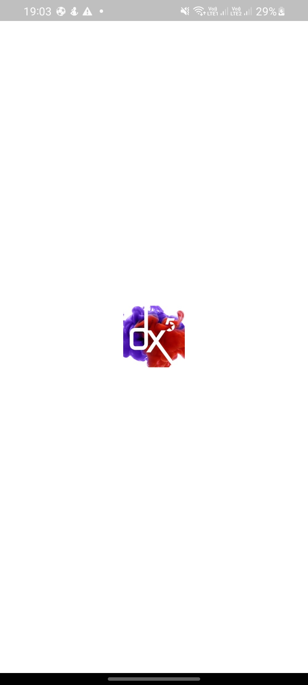
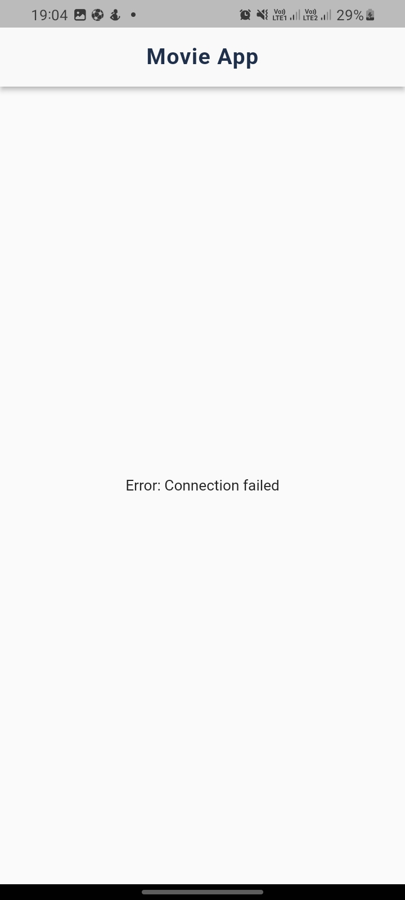

# dx5_interview

## Description

Build a simple Flutter mobile application that fetches and displays data from a Node.js/Express
API.

# iNetAfrica Interview Test.

## Mid-Level Developer Pre-screening test

Timeline: 4 days

## Project Requirements
1. The Application must fetch data from a given API endpoint and display it on screen
2. API used for data: A simple Node.js + Express script hosted on Heroku, or that I can run locally, that returns mock user data
3. User interface must utilize common Flutter widgets like ListView, Text, etc to display fetched data.
4. Code quality best practices like separation of concerns, single responsibility principle, etc, should be followed
5. Declare required dependencies in pubspec.yaml and import them correctly.
6. Add error handling for API calls.
7. Write well documented, clean and readable code.
8. Application must run and display fetched data successfully on emulator/simulator.

## Quick Start
This is a normal flutter app. You should follow the instructions in the [official documentation](https://flutter.io/docs/get-started/install).
This project uses **MVVM** (business logic component) [MvvM](https://betterprogramming.pub/how-to-use-mvvm-in-flutter-4b28b63da2ca) to separate the business logic with UI itself.

## Getting Started
This application is using api of <a target="_blank" href="https://www.themoviedb.org/">themoviedb</a>, so before using it you have to create an api from <a  target="_blank" href="https://www.themoviedb.org/">themoviedb</a> and generate an API and apply it to this application, follow the below step to connect api with this app.

First go to <a target="_blank" href="https://www.themoviedb.org/documentation/api">https://www.themoviedb.org/documentation/api</a>, and follow the API Documentation, you will get the API Code.

## Modularization Structure 🔥
# Root Project
    .
    │   
    |
    └── lib                        # Name of module (default from Flutter).
        |── core                   # Name of module.
        |── data                   # Network calls.
        ├── presentations          # Activity/View layer
        ├── theme                  # App styling themes.
        ├── widget                 # Styles for app.

## How to run the app

Step 1: Set Up Your Development Environment

Make sure you have Node.js and npm (Node Package Manager) installed on your computer. You can download them from the official website: https://nodejs.org/

Step 2: Create a New Project Folder

Create a new folder for your project and navigate to it using your terminal or command prompt.

Step 3: Initialize a Node.js Project

Run the following command to create a package.json file which will hold your project's dependencies and metadata:


``` npm init -y ```

Step 4: Install Dependencies

Install the necessary packages for your project. In this case, we'll use Express.js to create the API and Axios to make HTTP requests to the TMDb API. Run the following command to install them:


``` npm install express axios ```

To run your Node.js-based movie API locally, you can follow these steps:

Step 5: Make Sure You've Installed Dependencies

Ensure that you have already installed the required dependencies for your project. You should have Express.js, Axios, and any other necessary packages installed. You can install them with the following command if you haven't already. 

Replace 'YOUR_TMDB_API_KEY' with the API key you obtained from TMDb.:

``` npm install express axios ```

Step 6: Start the Server

In your project directory, open a terminal or command prompt and run the following command to start your Node.js server:

``` node app.js ```

You should see a message indicating that the server is running on a specific port (e.g., "Server is running on port 3000"). This port number is defined in your app.js file or as an environment variable.

To access your Node.js API running on your computer's localhost from an emulator or a physical device, you will need to use the IP address of your computer on the local network instead of "localhost." Here are the steps:

Step 1: Find Your Computer's IP Address

You need to find the IP address of your computer on the local network. On most operating systems, you can do this by opening a command prompt or terminal and running one of the following commands:

### For Windows:
``` ipconfig ```

Look for the "IPv4 Address" under your active network connection.

### For macOS or Linux:
``` ifconfig ```

Look for the "inet" address under your active network connection.

Step 2: Update Your Flutter App's API Request URL

In your Flutter app, update the URL you use to make API requests to replace "localhost" with your computer's local IP address. For example:

``` final response = await http.get(Uri.parse('http://YOUR_COMPUTER_IP:3000/api/movies')) ```

Replace YOUR_COMPUTER_IP with the actual IP address you found in Step 1. Make sure you keep the port number (e.g., :3000) if your Node.js API is running on that port.

Step 3: Allow Network Access

Ensure that your firewall and security settings on your computer allow incoming connections on the port your Node.js API is running on (e.g., 3000). Adjust your firewall settings as needed to allow access.

Step 4: Ensure Both Devices Are on the Same Network

Your Flutter emulator or physical device must be connected to the same local network as your computer running the Node.js API. If they are on different networks, they may not be able to communicate.

Step 5: Test the Connection

Run your Flutter app on your emulator or physical device as mentioned in previous steps. It should now be able to access the Node.js API using your computer's IP address. Make sure your computer is powered on and the Node.js server is running.

By making these changes, your Flutter app should be able to connect to your Node.js API hosted on your computer, whether you're testing on an emulator or a physical device on the same local network.

## How to run the App
1. Clone this project.
2. Open with your favorite tools editor.
3. Run `Pub get` on each module sequentially starting from `dependencies`, `core`, `shared`, and `your root project` to generated `pubspec.lock` file.
4. Add your `ip address` into ***fetch data*** file. 


# Screenshots
- Projects starts from the splash screen and goes to the movie details screen
  
  
   | |  |  | 


## Thank you Dx5ve
I'd like to thank **Dx5ve**, and *every single individual* that helped in bringing this learning experience. Thank you!